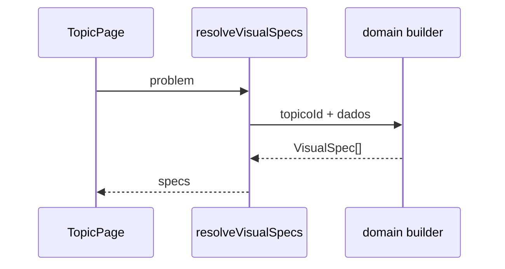

# Fase 2 — VisualSpec e resolução

## Objetivo

Definir contratos de figura e resolver `Problem` → `VisualSpec[]` sem acoplar domínios à UI.

## Arquivos

```
src/core/presentation/visual/types.ts
src/core/presentation/visual/resolve-visual-specs.ts
src/infrastructure/visual/builders/index.ts
src/infrastructure/visual/builders/calculo.ts
src/infrastructure/visual/builders/calculo-vetorial.ts
src/infrastructure/visual/builders/analise-exploratoria.ts
src/infrastructure/visual/builders/probabilidade.ts
```

## Fluxo



## Regras

1. Um builder por disciplina (ou por tópico se ficar grande).
2. `switch (dados.tipo)` dentro do builder.
3. Retornar array vazio se não houver visualização — nunca quebrar a página.
4. Specs são **serializáveis** (sem funções) para futuro SSR/hydration estável.

## Tipos base

- `PlotBounds`: `{ xMin, xMax, yMin, yMax }`
- `Point2D`, `Point3D`
- `FunctionPlotSpec`: amostras `{ x, y }[]` ou coeficientes polinomiais
- Marcadores: pontos, assíntotas, buracos (limites)
